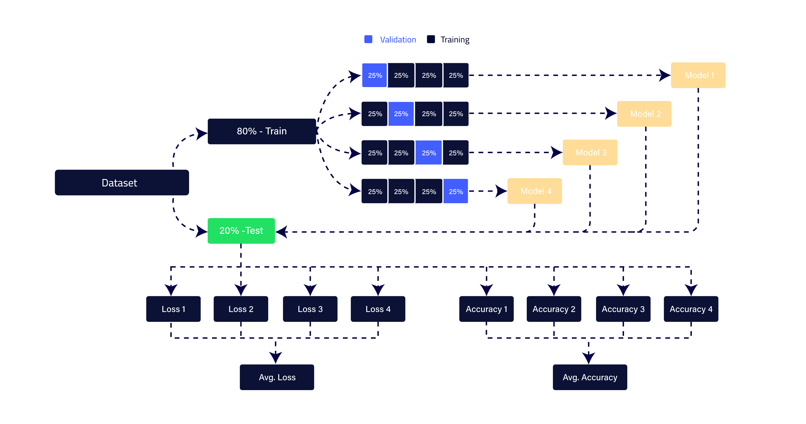

# JudgerAI | Your Dream's Legal AI Assistant
Introducing **JudgerAI** - the revolutionary NLP application that predicts legal judgments with stunning accuracy! Say goodbye to the guesswork of legal decision-making and hello to unparalleled efficiency and precision. **JudgerAI** uses advanced natural language processing algorithms to analyze past cases, legal precedents, and relevant data to provide accurate predictions of future legal outcomes. With **JudgerAI**, legal professionals can make informed decisions, save time, and improve their success rates. Trust in the power of AI and let **JudgerAI** lead the way to a smarter, more efficient legal system.

Natural Language Processing (NLP) has been increasingly used in the legal field for various tasks, including predicting the outcomes of legal judgments. Legal judgment prediction involves analyzing and predicting the outcome of a legal case based on the language used in the legal documents.

**JudgerAI** can be used to analyze the language of legal cases and predict the outcome of similar cases based on patterns and trends in the language. By using **JudgerAI**, legal professionals can save time and resources by identifying relevant cases and predicting their outcomes, thereby making more informed decisions.

One of the main challenges in legal judgment prediction using NLP is the complexity and variability of legal language. Legal documents often use technical terminology, jargon, and complex sentence structures that can be difficult for NLP models to analyze accurately. Additionally, legal cases can be influenced by various factors, including the specific circumstances of the case, the legal jurisdiction, and the judge's personal beliefs and biases.

Despite these challenges, NLP has shown promising results in legal judgment prediction. Researchers have used NLP techniques such as machine learning and deep learning to analyze legal language and predict the outcomes of legal cases with high accuracy. These techniques involve training NLP models on large datasets of legal cases and using them to predict the outcome of new cases based on the language used in the documents.

Here is a quick demo for **JudgerAI**:

[](https://youtu.be/ny-m9eb1-5c?si=7dB22OIxR0EUS6sY)


<!DOCTYPE html>
<html lang="en">

<head>
    <meta charset="UTF-8">
    <meta name="viewport" content="width=device-width, initial-scale=1.0">
</head>

<body>
    <iframe width="560" height="315" src="https://www.youtube.com/embed/ny-m9eb1-5c?si=fSZhE8lZbzMny00p"
        title="YouTube video player" frameborder="0"
        allow="accelerometer; autoplay; clipboard-write; encrypted-media; gyroscope; picture-in-picture; web-share"
        allowfullscreen>
    </iframe>
</body>

</html>


# Dataset
The Dataset consists of **3464** legal cases in a variety of fields, the key features of the dataset are the `first_party`, `second_party`, `winner_index`, and `facts`. here is a quick look at the dataset structure:

| column | datatype | description |
| ---    | ---      | ---         |
| ID     | int64    | Defines the case ID |
| name     | string    | Defines the case name |
| href     | string    | Defines the case hyper-reference |
| first_party     | string    | Defines the name of the first party (petitioner) of a case |
| second_party     | string    | Defines the name of the second party (respondent) of a case |
| winning_party     | string    | Defines the winning party name of a case |
| winner_index     | int64    | Defines the winning index of a case, 0 => the first party wins, 1 => the second party wins |
| facts     | string    | Contains the case facts that are needed to determine who is the winner of a specific case |

The input of **JudgerAI** models will be the case `facts`, and the target will be the `winner_index`.

# Modules
For organizational purposes, we divide the code base across 5 modules: `preprocessing`, `plotting`, `utils`, `main`, and `deployment_utils.py`.

1. [**preprocessing module**](https://github.com/MohammedAly22/JudgerAI/blob/main/src/preprocessing.py):
`preprocessing` module contains the `Preprocessor` class which is responsible for all kinds of preprocessing on the case facts such as tokenization, converting case facts to vectors using different techniques, balancing data, anonymizing facts, preprocessing facts, etc. **balancing - anonymization - preprocessing** are covered in **Experiments** section.
2. [**plotting module**](https://github.com/MohammedAly22/JudgerAI/blob/main/src/plotting.py):
`plotting` module contains the `PlottingManager` class which is responsible for all plotting & visualizations of **JudgerAI** models' performance measures including losses and accuracies curves, detailed losses and accuracies heatmaps, ROC-AUC curves, classification reports, and confusion metrics.
3. [**utils module**](https://github.com/MohammedAly22/JudgerAI/blob/main/src/utils.py):
`utils` module contains several useful functions that will be re-used in various models: the `train_model()` function that uses k-fold cross-validation for training a specific model, `print_testing_loss_accuracy()` that summarizes testing loss and testing accuracy for each fold, `calculate_average_measure()` which is used for calculating average of the passed `measure` which can be loss, val_loss, accuracy, or val_accuracy.
4. [**main module**](https://github.com/MohammedAly22/JudgerAI/blob/main/src/main.py):
The `main` module contains the `streamlit` deployment (frontend website components).
5. [**deployment utils module**](https://github.com/MohammedAly22/JudgerAI/blob/main/src/deployment_utils.py):
The `deployemnt_utils` module contains several useful things that will be used in the deployment like loading the trained models and preparing the input case facts: the `generate_random_sample()` function that will fetch a random sample from the testing set to test it, `generate_highlighted_words()` that highlights the words contributing in the model's decision, `VectorizerGenerator` class is responsible for creation and generation of tokenizers and text vectorizers for JudgerAIs' models, and `Predictor` class is responsible for get predictions in JudgerAIs' models. 

# Models
JudgerAI was trained using 5 different models and they are: **Doc2Vec**, **1D-CNN**, **TextVectorization with TF-IDF**, **GloVe**, and **BERT**. Our selection for this list of models was dependent on the fact that we want to try different models including the old ones like `Doc2Vec` as well as the slightly new ones like `BERT` to see if there is progress in our predictions. Here is a quick overview of each model's origins and its basic idea:

## Doc2Vec:
**Doc2Vec** is a natural language processing (NLP) technique that was first introduced in ["Distributed Representations of Sentences and Documents" by Quoc Le and Tomas Mikolov](https://cs.stanford.edu/~quocle/paragraph_vector.pdf) that allows machines to understand the meaning of entire documents, rather than just individual words or phrases.

It is an extension of the popular Word2Vec technique, which creates vector representations of individual words. With Doc2Vec, each document is represented as a unique vector, which captures the meaning and context of the entire document. This is useful in a wide range of applications, such as sentiment analysis, content recommendation, and search engine ranking.

## 1D-CNN:
**CNN** stands for Convolutional Neural Network, which is a type of artificial neural network commonly used in computer vision tasks such as image recognition and object detection. However, CNNs have also been applied successfully in natural language processing (NLP) tasks, such as text classification and sentiment analysis and all of this began in ["Convolutional Neural Networks for Sentence Classification", 2014](https://arxiv.org/abs/1408.5882). 

In NLP, CNNs are used to learn features from raw textual data, such as words or characters. The CNN architecture involves a series of convolutional layers, which apply filters to the input data to extract relevant features. These features are then passed through one or more fully connected layers to produce a final output. One of the advantages of using CNNs in NLP is their ability to learn local and global features from the input data. Local features refer to patterns within individual words or phrases, while global features refer to patterns across the entire document or corpus. By learning local and global features, CNNs can capture the context and meaning of the text more effectively than traditional NLP techniques.

## TextVectorization with TF-IDF:
### TextVectorization:
**`TextVectorization`** is a feature in the Keras deep learning library that allows you to easily preprocess and vectorize textual data. It converts raw text data into numerical vectors that can be used as input to a neural network. The TextVectorization layer works by tokenizing the input text into individual words or subwords and then encoding each token as a unique integer. 

The layer can also perform other text preprocessing tasks, such as converting text to lowercase, removing punctuation, and filtering out stop words. The resulting numerical vectors can be used as input to a neural network for a variety of NLP tasks, such as text classification, sentiment analysis, and language modeling. Here's an example of how to use the TextVectorization layer in Keras:
```python
from tensorflow.keras.layers.preprocessing import TextVectorization

# Create a TextVectorization layer
vectorizer = TextVectorization(max_tokens=1000, output_mode='int')

# Fit the layer to the training data
train_text = ['This is a sample sentence', 'Another sample sentence']
vectorizer.adapt(train_text)

# Transform the input data into numerical vectors
test_text = ['A new sentence', 'A third sentence']
vectorized_text = vectorizer(test_text)
```
In this example, the TextVectorization layer is created with a maximum vocabulary size of 1000 tokens and an output mode of 'int', which encodes each token as a unique integer. The layer is then fit to the training data, and the adapt method is used to learn the vocabulary from the training data. Finally, the layer is used to transform the test data into numerical vectors.

### TF-IDF:
**TF-IDF** stands for Term Frequency-Inverse Document Frequency and is a popular technique in information retrieval and text mining for measuring the importance of words in a document or corpus. It was first introduced in ["A Statistical Interpretation of Term Specificity and Its Application in Retrieval, 1970s"](https://dl.acm.org/doi/10.1145/361219.361220). The basic idea behind TF-IDF is to give more weight to words that are frequent in a document but rare in the corpus as a whole. This is because such words are more likely to be important and informative about the content of the document.

## GloVe
**GloVe (Global Vectors for Word Representation)** is a popular unsupervised learning algorithm for generating word embeddings, which are vector representations of words that capture their semantic meaning. GloVe was developed by researchers at Stanford University, including Jeffrey Pennington, Richard Socher, and Christopher D. Manning, and was first introduced in [GloVe: Global Vectors for Word Representation, 2014](https://nlp.stanford.edu/pubs/glove.pdf). 

The basic idea behind GloVe is to use co-occurrence statistics to learn word embeddings. The algorithm considers the co-occurrence statistics of words in a large corpus of text and uses them to learn vector representations of words that capture their semantic meaning. In particular, GloVe aims to learn word embeddings that preserve the relationships between words, such as synonymy and analogy.

## BERT
**BERT (Bidirectional Encoder Representations from Transformers)** is a powerful pre-trained language model developed by researchers at Google, including Jacob Devlin, Ming-Wei Chang, Kenton Lee, and Kristina Toutanova. BERT was first introduced in a [BERT: Pre-training of Deep Bidirectional Transformers for Language Understanding, 2018](https://arxiv.org/abs/1810.04805), and since then has become one of the most widely used models in natural language processing. The basic idea behind BERT is to pre-train a deep neural network on a large corpus of text, and then fine-tune the model for specific NLP tasks such as question answering, sentiment analysis, and text classification. BERT is unique in that it uses a bidirectional transformer architecture, which allows it to capture the context and meaning of words within a sentence or paragraph.

## Long Short-Term Memory (LSTM)
LSTM (Long Short-Term Memory) is a type of recurrent neural network (RNN) architecture that is designed to overcome the limitations of traditional RNNs in capturing long-term dependencies in sequential data. It was first introduced by Sepp Hochreiter and Jürgen Schmidhuber in their paper titled ["Long Short-Term Memory": 1997](https://www.bioinf.jku.at/publications/older/2604.pdf)

LSTM networks are particularly effective in tasks that involve sequential data, such as speech recognition, natural language processing, and time series analysis. They are capable of learning and remembering information over long sequences, making them well-suited for modeling and predicting patterns in sequential data.
The key idea behind LSTM is the introduction of memory cells, which allow the network to selectively remember or forget information over time. Each LSTM unit consists of three main components: the input gate, the forget gate, and the output gate.

1. Input Gate: The input gate determines how much of the new input should be stored in the memory cell. It takes into account the current input and the previous hidden state and produces an activation value between 0 and 1.

2. Forget Gate: The forget gate controls the extent to which the previous memory cell should be forgotten. It considers the current input and the previous hidden state and decides which information to discard from the memory cell. The forget gate also produces an activation value between 0 and 1.

3. Output Gate: The output gate determines the amount of information to be output from the memory cell. It considers the current input and the previous hidden state and produces an activation value between 0 and 1.

The memory cell, which is the core component of LSTM, stores and updates information over time. It is responsible for maintaining the long-term memory of the network. The input gate, forget gate and output gate regulate the flow of information into, out of, and within the memory cell.
LSTM networks have shown remarkable success in various applications, especially in tasks that involve long-term dependencies and sequential data. They have been widely adopted and have become a fundamental building block in many state-of-the-art deep learning models.

## FastText
FastText is a library and approach for efficient text classification and representation learning developed by Facebook AI Research. It was first introduced by Armand Joulin, Edouard Grave, Piotr Bojanowski, and Tomas Mikolov in their paper titled ["Bag of Tricks for Efficient Text Classification": 2016](https://arxiv.org/abs/1607.01759).

FastText is an extension of the popular word embedding technique called Word2Vec. It represents words as continuous vectors in a high-dimensional space, capturing semantic and syntactic information. However, FastText goes beyond individual words and introduces a subword-level representation.
The key idea behind FastText is to represent words as a bag of character n-grams, where n-grams are contiguous sequences of characters. By considering subword information, FastText can handle out-of-vocabulary words and capture morphological similarities between words.
Here's a high-level overview of the FastText approach:

1. Building the Vocabulary: FastText constructs a vocabulary by considering all unique words and character n-grams present in the training corpus.

2. Computing Word Representations: Each word is represented as the sum of its character n-gram embeddings. The character n-gram embeddings are learned along with the word embeddings during the training process.

3. Training the Classifier: FastText trains a linear classifier (such as logistic regression or softmax) on top of the word representations to perform text classification tasks. The classifier is trained using the hierarchical softmax or the negative sampling technique.

FastText has gained popularity due to its efficiency and effectiveness in various natural language processing tasks, including text classification, sentiment analysis, and language identification. It has been widely adopted and has become a valuable tool for many researchers and practitioners in the field.

# Experiments
To achieve the best results, we tried different experiments in **JudgerAI** to see each experiment's effect on the final accuracy of **JudgerAI** models, here is a list of 3 experiments that were taken into consideration:
- Data Preprocessing:
  Including removing stopwords, lowercasing all letters, stemming, and removing non-alphabet characters except the `_` letter, punctuation, and digits.
- Data Anonymization:
  Replacing parties' names from the case facts with a generic `_PARTY_` tag to make sure that models are not biased towards parties' names.
- Label Class Imbalance:
  Dealing with class imbalance as a standalone preprocessing step to see if there was an impact on the final accuracy of the **JudgerAI** models or not.

Each experiment of the above 3, can be made or not, so, we ended up with 8 (2 to the power of 3) possible combinations and they were:
| Preprocessing | Data Anonymization | Label Class Imbalance |
| ---    | ---      | ---         |
| 0     | 0    | 0 |
| 0     | 0    | 1 |
| 0     | 1    | 0 |
| 0     | 1    | 1 |
| 1     | 0    | 0 |
| 1     | 0    | 1 |
| 1     | 1    | 0 |
| 1     | 1    | 1 |

As a result, we will end up with 8 different results representing the effect of each experiment on the final model's decision.

# Training
A quick overview of the training methodology, First we divided the dataset into training and testing parts with a proportion of 80:20 and this division will be constant for all of JudgerAI's models to test all models on the same test set to make the results comparable. Therefore, the training data was divided into 4 parts or more specifically 4 folds each fold is 25% of the data that we used to train JudgerAI's models using 4-fold cross-validation. So we ended up with 4 testing accuracies representing the performance of each fold on the testing data. 

Here is an illustration graph for training methodology:



**An important** part to mention here is that these 4 testing accuracies will be per combination. Let me clarify this by considering the `Doc2Vec` model, first, we set up our eight combinations, then in each combination, we trained a `Doc2Vec` model with 4-fold cross-validation, so, we ended up with 32 (8 x 4) testing accuracies, then, we will choose the best combination and the best fold that can generalize well on the testing data and save it for later use.

# Final Steps
After training the above 5 models and saving the best model combination that performs well on the testing set, we have made a simple step of **ensemble learning** between models to give the most accurate prediction, and this was done by simply using **voting** between models on the winner of a specific case.

# Additional
For a more detailed explanation of **JudgerAI** and to see the results of its models in much more detail, please, go to each model's notebook to see a detailed explanation of the powerful legal assistant "JudgerAI", Thanks.
